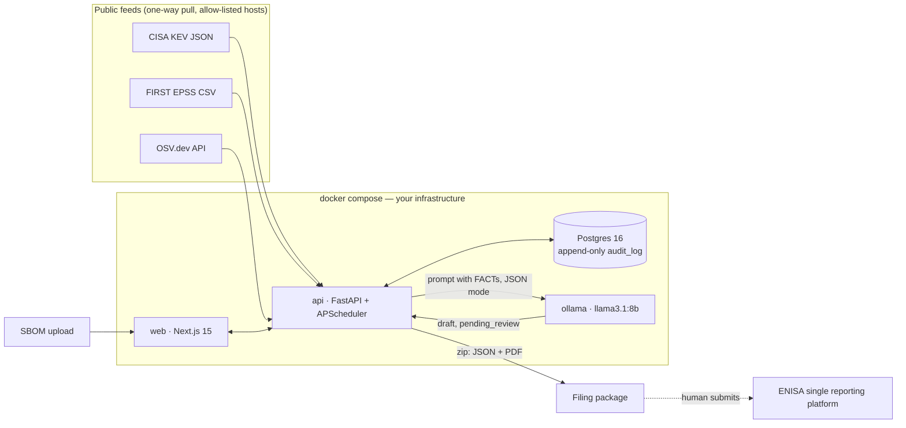

# Frist24

**CRA Article 14 reporting, without the panic.** A local-first assistant that turns "a CVE just hit
CISA KEV and it is in a controller we shipped in 2021" into an approved, filing-ready early warning
inside 24 hours, with a hash-chained audit trail of who approved what and when.

> MunichTech EXPO Hackathon 2026 — "Build What Europe Needs". Devpost deadline 20 Sep 2026 17:00 CEST.

## The problem
Since **11 September 2026**, Article 14 of Regulation (EU) 2024/2847 (Cyber Resilience Act, CRA) obliges
every manufacturer of a product with digital elements sold in the EU to report *actively exploited
vulnerabilities* to ENISA and their national CSIRT (Germany: BSI) through the single reporting platform:

| Deadline (from becoming aware) | Report |
|---|---|
| 24 hours | Early warning |
| 72 hours | Vulnerability notification |
| 14 days after a fix/workaround is available | Final report |

Legacy products already on the market count. Fines reach €15 M or 2.5 % of worldwide turnover. A typical
Mittelstand manufacturer has 10–100 SKUs, no PSIRT, and answers "which SKUs are affected?" with a
spreadsheet. The 24-hour clock does not wait for the spreadsheet.

## What Frist24 does
1. **Inventory** products (SKUs) and upload their SBOMs (CycloneDX or SPDX JSON).
2. **Pull real public feeds**, one-way: CISA KEV, FIRST EPSS, OSV.dev. Every 15 minutes and on demand.
3. **Deterministic rule:** a component matches a CVE *and* that CVE is in KEV ⇒ an incident opens,
   `aware_at` is set, the 24h / 72h / 14d clocks start. Nothing else opens an incident.
4. **Local LLM drafting** (Ollama, llama3.1:8b): drafts the early warning and the 72h notification in
   English and German. FACT fields are stamped from the database; the model only writes TEXT fields.
5. **Human approval:** every draft is `pending_review`. The reviewer edits TEXT fields, approves or rejects.
   FACT fields are re-verified against the database at approval time.
6. **Append-only, hash-chained audit log** of every step, enforced by a database trigger and verifiable
   from the UI.
7. **Filing package** export (zip: JSON + PDF per report in EN and DE, facts, KEV entry, audit trail).
   The human submits it on the ENISA platform.
8. **Alerts**: optional webhook (`NOTIFY_WEBHOOK_URL`) fires one JSON summary per sync when incidents open, so
   the right person is paged at 16:00 on a Friday. A read-only **Settings** page shows the running configuration,
   feed status, model status and the egress allow-list.

No vulnerability data leaves the machine. Feed downloads are pulls of public data from an allow-list of hosts.

## Architecture


**Deterministic first, LLM second.** The pipeline that opens incidents (`services/matching.py`,
`services/incidents.py`) never touches the model. The model (`services/drafting.py`) receives the FACTs,
returns JSON, and every FACT field is overwritten from the database again before validation. Deviations are
counted in the audit payload. If the model is down or returns garbage twice, a template draft is created
instead, clearly marked `source=template`.

## Quickstart
Requirements: Docker with Compose v2 (Windows: Docker Desktop with the WSL 2 backend). First start pulls
`llama3.1:8b` (~4.9 GB); the rest is small. Everything works without the model except LLM drafting, which
falls back to templates until the pull finishes.

```bash
git clone <repo> frist24 && cd frist24
cp .env.example .env           # optional; defaults work
docker compose up -d --build   # = make up
docker compose logs -f ollama-pull   # watch the model download (one-time)

# open http://localhost:3000        API docs: http://localhost:8000/docs
# seed two SKUs with real SBOMs, sync feeds, open real incidents (~45 s cold, ~20 s warm):
docker compose exec api python -m app.cli demo    # = make demo
```

Without `make`: `make up` = `docker compose up -d --build`, `make demo` = `docker compose exec api python -m app.cli demo`,
`make logs` = `docker compose logs -f`, `make reset` = `docker compose down -v && docker compose up -d --build`,
`make test-api` = `docker compose exec api pytest -q`, `make test-web` = `docker compose exec web npm test`.

### Demo walkthrough (what the video shows)
1. **Products**: `HMI-4100` (operator panel, discontinued 2023) and `EGW-7200` (edge gateway) with real
   CycloneDX SBOMs (883 and 903 components).
2. **Incidents**: after `make demo`, five incidents from real KEV CVEs, sorted by next deadline, each with a
   live countdown: `HMI-4100 × CVE-2020-11023` (jQuery XSS, KEV since 2025-01-23) and `EGW-7200 ×
   CVE-2022-22965` (Spring4Shell), `CVE-2025-24813`, `CVE-2020-1938`, `CVE-2023-44487` (Tomcat).
3. **Draft EN with local LLM** → spinner "drafting locally — no data leaves this machine" → structured draft:
   green FACT fields (read-only), amber TEXT fields (editable). Switch to DE and draft again.
4. Edit one TEXT field, **Save edits**, **Approve** → incident status advances, timeline shows the
   hash-chained rows (`report.drafted`, `report.edited`, `report.approved`).
5. **Draft 72h notification** the same way; **Download filing package** (zip with JSON + PDF).
6. **Audit** page → **Verify chain**.

### Local development without Docker
```bash
cd api && uv venv .venv --python 3.12 && uv pip install -e ".[dev]" --python .venv/Scripts/python.exe
python scripts/dev_pg.py            # embedded Postgres 16 (pgserver); prints DATABASE_URL
DATABASE_URL=... .venv/Scripts/python -m alembic upgrade head
DATABASE_URL=... .venv/Scripts/python -m uvicorn app.main:app --reload   # + ollama serve locally
cd ../web && npm install && NEXT_PUBLIC_API_URL=http://localhost:8000 npm run dev
```
Tests: `DATABASE_URL=... pytest` in `api/` (18 tests; live-feed tests skip with `FRIST24_OFFLINE=1`, the live-Ollama test skips when no model is reachable),
`npm test` in `web/`.

## Repository layout
```
api/app/models/entities.py   data model (products, sboms, components, kev_entries, epss_scores,
                             vulnerabilities, matches, incidents, reports, audit_log, feed_syncs)
api/alembic/versions/0001    schema + append-only triggers on audit_log
api/app/services/feeds.py    KEV / EPSS / OSV loaders (allow-list asserted)
api/app/services/matching.py exact-PURL matching, in_kev + epss flags
api/app/services/incidents.py  THE rule that opens incidents
api/app/services/facts.py    deterministic FACT fields + LLM context
api/app/services/drafting.py Ollama drafting with FACT re-stamping, retry, template fallback
api/app/services/reports.py  edit (TEXT only) / approve (facts re-verified) / reject, all audited
api/app/services/audit.py    hash chain (sha256, advisory lock) + verify
api/app/services/export.py   filing package (zip: JSON + PDF)
api/prompts/                 early_warning.md (ew-v1), notification.md (nt-v1)
web/app/                     / dashboard, /products, /products/[id], /incidents (search + filters), /incidents/[id], /audit, /settings
fixtures/                    real public SBOMs + provenance (fixtures/README.md)
scripts/                     find_fixtures.py, scan_public_sboms.py, smoke.sh, dev_pg.py
docs/                        brief: CONTEXT, DATA_SOURCES, REPORT_SCHEMA, BUILD_PLAN, DEVPOST
DECISIONS.md / TODO.md       non-obvious choices / cut scope
```

## Data model (derived; docs/SPEC.md was not part of the delivered brief)
- **Product** (sku) → **Sbom** (format, sha256) → **Component** (name, version, **purl**, ecosystem)
- **KevEntry** (cve_id PK, date_added, …) — presence == actively exploited
- **Vulnerability** (OSV id PK, cve_id alias, CVSS from vector) ← **Match** (component × vulnerability,
  match_type `purl_exact`, `in_kev`, `epss`, `affected_range`)
- **Incident** (product × cve_id, unique; `aware_at`; `deadline_early_warning` = +24h,
  `deadline_notification` = +72h, `deadline_final_report` = +14d provisional, re-anchored on fix availability)
- **Report** (incident, stage, language, version, `status` = pending_review | approved | rejected,
  `content` JSON, `fact_fields`, `source` = llm | template | human, `model`, `prompt_version`)
- **AuditLog** (ts, actor, action, entity, payload, `prev_hash`, `hash`) — UPDATE/DELETE/TRUNCATE raise

## API (OpenAPI at `/docs`)
`GET/POST /products`, `POST /products/{id}/sbom`, `GET /products/{id}/components` ·
`POST /sync`, `GET /sync/status` · `GET /incidents`, `GET /incidents/{id}`,
`POST /incidents/{id}/reports/template`, `POST /incidents/{id}/fix-available`, `POST /incidents/{id}/close`,
`GET /incidents/{id}/package` · `POST /draft/{stage}?incident_id&language`, `GET /draft/status` ·
`GET/PATCH /reports/{id}`, `POST /reports/{id}/approve|reject` · `GET /audit`, `GET /audit/verify` · `GET /settings` · `GET /health`

## Data sources (all real, all public, all one-way)
| Source | Used for | Refresh |
|---|---|---|
| [CISA KEV](https://www.cisa.gov/known-exploited-vulnerabilities-catalog) | the "actively exploited" oracle (opens incidents) | 15 min |
| [FIRST EPSS](https://www.first.org/epss/) | triage ordering only (never a trigger) | daily CSV, filtered to KEV ∪ matched CVEs |
| [OSV.dev](https://osv.dev) | component → vulnerability by PURL, CVE aliases, ranges, CVSS vectors | on every sync, details cached |
| CycloneDX bom-examples | real SBOMs for the demo | fixed |

Outbound allow-list (logged at API start, asserted in code): `www.cisa.gov`, `epss.cyentia.com`,
`api.first.org`, `api.osv.dev`, `services.nvd.nist.gov` (reserved, not called), plus the local Ollama service.

## Real vs. simulated
- **Real:** KEV catalog (1,713 entries on 2026-09-18), EPSS scores, OSV matches (644 vulnerability records
  for 1,786 distinct PURLs), the SBOMs (unmodified public CycloneDX files), the LLM drafts.
- **Simulated:** the manufacturer identity (`FRIST24_MANUFACTURER_NAME`), the claim that the five demo SKUs embed
  those SBOMs (they are public SBOMs of Proton Mail's web client, Keycloak 10.0.2, Dropwizard 1.3.15, Proton Bridge
  1.8.0 and OWASP Juice Shop, see `fixtures/README.md`), and the **workflow history**: `make demo` back-dates five
  incidents to the day after their CVE entered KEV and approves template reports under demo reviewer names. Those
  rows are flagged `synthetic_history: true` in the audit log and carry actor `demo:history`. Disable with
  `DEMO_HISTORY=false` or `python -m app.cli demo --no-history`. The two live incidents are untouched.

## Limitations (honest list)
- **No submission to ENISA.** The single reporting platform has no public API; we export a filing-ready package.
- **Report schemas are our interpretation** of Art. 14(2)–(4); the official form fields are not published as a
  machine schema. Field names follow `docs/REPORT_SCHEMA.md`.
- **KEV is a US catalog.** ENISA's EU Vulnerability Database (EUVD) exploitation flags are the natural EU-native
  second source; roadmap.
- **Exact-PURL matching only.** Components without a PURL (common for C/C++ firmware) are counted but not matched;
  the fuzzy/LLM-confirmed path is a stub.
- **Final report** has schema, endpoint and template, but no dedicated prompt (reuses the notification prompt).
- **German** output from llama3.1:8b is serviceable, not native; human review is mandatory anyway.
- **CPU inference** takes about two minutes per draft on a 14-core laptop without GPU.
- **Single reviewer role**, no authentication; `X-Actor` names the person. Not multi-tenant.
- **Severe-incident flow** (non-vulnerability) exists only in the data model's status vocabulary.
- **Web container runs `next dev`**, not a production build.
- The 14-day clock is anchored to `aware_at` provisionally and re-anchored to fix availability via
  `POST /incidents/{id}/fix-available`, matching the CRA wording.

## EU AI Act and GDPR notes
- The LLM produces *draft text for a human to review*; it makes no decision with legal effect. Incidents are
  opened by a published, deterministic rule (KEV membership). This keeps Frist24 out of the high-risk
  categories of the AI Act and makes the human-oversight requirement structural, not procedural.
- Every model output is labelled with model name and prompt version, stored as `pending_review`, and the
  approval is attributable to a named reviewer in an append-only log.
- The model runs on the manufacturer's own infrastructure. No prompt, SBOM, or vulnerability detail is sent to
  a third party. Feed pulls disclose nothing about the manufacturer beyond the request itself.
- Personal data processed: reviewer names in the audit log (necessary for accountability under Art. 14) and
  the manufacturer contact address in reports. No end-user data.

## UI
Light theme by default, dark theme via the toggle in the header (remembered per browser). Semantic colour tokens,
reduced-motion aware animations, FACT fields green and TEXT fields amber throughout.

## Roadmap
See [docs/PRODUCT_ROADMAP.md](docs/PRODUCT_ROADMAP.md) for the full prototype-to-product list. Short version:
EUVD as second exploitation source · fuzzy matching with LLM-assisted confirmation (still `needs_review`) ·
dedicated final-report prompt · severe-incident flow · SSO/RBAC · production web build · optional Kubernetes
manifests · notification when a new KEV entry hits an existing component (e-mail/webhook) · per-market
member-state configuration for `member_states_affected`.

## License
MIT (hackathon prototype).
