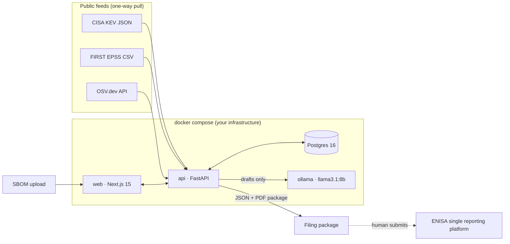

# Frist24

**CRA Article 14 reporting, without the panic.** Local-first assistant that turns "a CVE just hit
CISA KEV and it is in a controller we shipped in 2021" into a filed early warning inside 24 hours.

> MunichTech EXPO Hackathon 2026 — "Build What Europe Needs". Devpost deadline 20 Sep 2026 17:00 CEST.

## Problem
Since **11 September 2026**, Regulation (EU) 2024/2847 (Cyber Resilience Act) Article 14 obliges every
manufacturer of a product with digital elements sold in the EU to report *actively exploited
vulnerabilities* to ENISA and the national CSIRT: early warning within **24h**, notification within
**72h**, final report within **14 days** of a fix. Legacy products count. Fines reach €15M or 2.5% of turnover.
Most Mittelstand manufacturers have no PSIRT and answer "which SKUs are affected?" with a spreadsheet.

## Solution
1. Upload SBOMs (CycloneDX / SPDX) per product SKU.
2. Frist24 pulls **real** public feeds: CISA KEV, FIRST EPSS, OSV.dev.
3. **Deterministic rule:** component matches a CVE that is in KEV ⇒ incident opens, `aware_at` is set, clocks start.
4. A **local** LLM (Ollama) drafts the early warning and the 72h notification in EN and DE. FACT fields are
   copied from the database; only TEXT fields are written by the model.
5. A human reviews, edits, approves. Every action is written to an **append-only, hash-chained audit log**.
6. Export a filing-ready package (JSON + PDF). The human submits it on the ENISA single reporting platform.

No vulnerability data leaves the machine. Feed downloads are one-way pulls of public data.

## Architecture


## Quickstart
Requires Docker with Compose v2 (on Windows: Docker Desktop with the WSL 2 backend, i.e. the
"Virtual Machine Platform" and "Windows Subsystem for Linux" features enabled). First start pulls `llama3.1:8b` (~4.7 GB); everything else is small.
```bash
cp .env.example .env          # optional, defaults work
docker compose up -d --build  # or: make up
# web  http://localhost:3000
# api  http://localhost:8000/docs   health: http://localhost:8000/health
docker compose logs -f ollama-pull  # watch the model download
```
Later steps add `make demo` (seed products + SBOMs, sync feeds, open a real incident).

Without `make`: `make up` = `docker compose up -d --build`, `make down` = `docker compose down`,
`make logs` = `docker compose logs -f`, `make reset` = `docker compose down -v && docker compose up -d --build`.

## Repository layout
```
api/        FastAPI service — feeds, matching, incidents, drafting, audit, export
web/        Next.js 15 UI — products, incidents with live countdown, review, audit
ollama/     model-pull entrypoint
fixtures/   real public SBOMs used by the demo (see fixtures/README.md)
scripts/    fixture discovery, smoke tests
docs/       brief: CONTEXT, DATA_SOURCES, REPORT_SCHEMA, BUILD_PLAN
DECISIONS.md  non-obvious choices     TODO.md  cut scope
```

## Data sources
See [docs/DATA_SOURCES.md](docs/DATA_SOURCES.md). Outbound allow-list (logged at API startup):
`www.cisa.gov`, `epss.cyentia.com`, `api.first.org`, `api.osv.dev`, `services.nvd.nist.gov`, plus the local Ollama service.

## Real vs. simulated
- **Real:** KEV catalog, EPSS scores, OSV matches, SBOMs (from public OSS releases), LLM drafts.
- **Simulated:** the manufacturer identity (`FRIST24_MANUFACTURER_NAME`) and the two demo product SKUs that
  claim to embed those SBOMs.

## Limitations
_To be completed in step 12 from TODO.md._ Already known: no submission to the ENISA platform (no public API);
the report schemas are our interpretation of Art. 14, not the official form; KEV is a US catalog (EUVD is roadmap).

## License
MIT (hackathon prototype).
